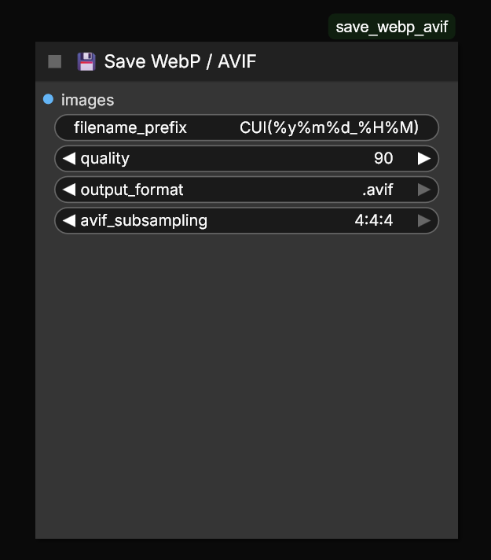

WebP or AVIF image output node for ComfyUI
---

- Workflow metadata save/load (drap&drop) supported.
- AVIF subsampling selectable: 4:4:4 (default) or 4:2:0
- AVIF encoder speed is optimum: 6
- Multiple images save (batch) supported.
- Custom filenames and date/time supported. (https://www.man7.org/linux/man-pages/man1/date.1.html)
- Quality 100 = Lossless.

Installation for Portable ComfyUI:
- Install <a href="https://github.com/Comfy-Org/ComfyUI-Manager" target="_blank">ComfyUI Manager</a> if it's not already installed, with "install-manager-for-portable-version.bat" file.
- Edit "\ComfyUI_windows_portable\ComfyUI\user\ __manager\config.ini" file -> "security_level = **weak**"
- Open "ComfyUI Manager" -> click "Install via Git URL" -> paste: "https://github.com/AlterMann3/save_webp_avif" -> Confirm.
- Restart ComfyUI.
(If AVIF support is missing, run `pip install pillow-avif-plugin` in your Python environment.)

You can find node in: _Add Node_ -> _image_ -> _💾 Save WebP / AVIF_
