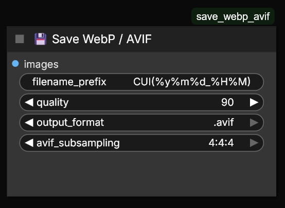

# Save WebP / AVIF
Custom node for ComfyUI to save images in **WebP** or **AVIF** format.

- Workflow metadata save/load (drap&drop) supported.
- AVIF subsampling: 4:4:4, encoder speed: 5.
- Multiple (batch) images supported.
- Custom filenames and date/time supported. (https://www.man7.org/linux/man-pages/man1/date.1.html)



#
Installation for Portable ComfyUI:
- Install [ComfyUI Manager](https://github.com/Comfy-Org/ComfyUI-Manager) if it's not already installed, via `"install-manager-for-portable-version.bat"` file.
- Edit file:  `"\ComfyUI_windows_portable\ComfyUI\user\__manager\config.ini"` -> _"security_level = **weak**"_  
- Open `ComfyUI Manager` -> click `"Install via Git URL"` -> copy&paste this and confirm:
```
https://github.com/AlterMann3/save_webp_avif
```
- Restart ComfyUI.

#
If AVIF support is missing, run this command from your `"\ComfyUI_windows_portable\python_embeded\"` directory:
```
python.exe -m pip install -U pillow-avif-plugin
```
#

You can find node in: _`Add Node`_->_`image`_->_`💾 Save WebP / AVIF`_

#

**AVIF settings:**  
100 = Lossless.  
98 = Near-Lossless.  
97 = Start of soft-banding.  
96 = High quality final image.  
80 = Normal quality.  
60 = Draft/test images.  

**WebP settings:**  
100 = Lossless. (filesize: 100%)  
98 = High quality. (filesize: ~31%)  
94 = Medium quality. (filesize: ~22%)  
86 = Low quality. (filesize: ~14%)  
65 = Draft/test images. (filesize: ~8%)  

Due to 4:4:4 subsampling, AVIF offers better _color quality_ than WebP, there is no color bleeding in AVIF. (However, WebP "100" is also 4:4:4.)

Actually, you don’t need to use WebP. AVIF always produces better results. But since WebP is more widely used, I included it for compatibility.

Since ComfyUI typically generates from lossy sources, the raw output is also lossy; therefore, there is no advantage to using lossless or near-lossless settings.
